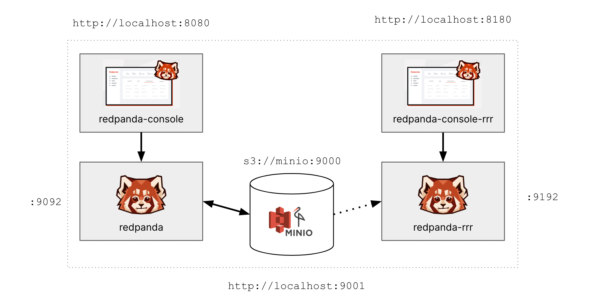

# Redpanda Tiered Storage and Remote Read Replicas

Tiered Storage is a Redpanda Enterpise feature that allows for low-cost infinite data retention by moving
log data to an archive while retaining the ability to serve it back to clients. It uses an object store
for the archive and communicates via the S3 protocol.

Remote Read Replica is a feature built on top of tiered storage that allows another Redpanda cluster to serve topics
(in read-only mode) that have been archived to S3. It allows for the dynamic provisioning of read-only topics for
analytical workloads.

This demo uses Docker Compose. It sets up two single-node Redpanda clusters, with one as the source and the other
to serve Remote Read Replicas.
Each cluster has an attached Redpanda Console instance. [MinIO](http://min.io) is used as the object store.



## Related Material

For more information on Tiered Storage and Remote Read Replicas, you can consult the following links.
* [Shadow Indexing Deep Dive](https://redpanda.com/blog/tiered-storage-architecture-shadow-indexing-deep-dive/)
* [Remote Read Replicas](https://redpanda.com/blog/remote-read-replicas-for-distributing-work)
* [Documentation](https://docs.redpanda.com/docs/data-management/)

## Pre-requisites

This demo uses [MinIO](https://min.io/) for local S3-compatible object storage.
To go through this demo, you will need:

* Docker
* `rpk` - Redpanda CLI
* `mc` - MinIO Console
* `tree` - Optional, for hierarchical directory listing

### Installing Pre-requisites

First, make sure you have [Docker Compose](https://docs.docker.com/compose/install/) installed.
Then you can follow these OS specific instructions to install the rest.

#### MacOS

```bash
brew install redpanda-data/tap/redpanda
brew install minio/stable/mc
brew install tree
```

#### Ubuntu

```bash
mkdir ~/bin 2> /dev/null; cd ~/bin
curl -LO https://github.com/redpanda-data/redpanda/releases/download/v21.11.15/rpk-linux-amd64.zip
unzip rpk-linux-amd64.zip && rm rpk-linux-amd64.zip
curl -O https://dl.min.io/client/mc/release/linux-amd64/mc
chmod +x mc
sudo apt install tree -y
```

Add the following to `~/.bashrc` or `~/.zshrc` if needed:
```bash
export PATH=$PATH:$HOME/bin
```

### Get the code

```bash
git clone https://github.com/patrickangeles/redpanda-si-demo.git
cd redpanda-si-demo
```

On Linux, change ownership of the `data` directory (Docker on Mac handles this automatically):
```bash
mkdir -p volumes/redpanda/data
sudo chown -R 101:101 volumes
```

## Overview of `docker-compose.yml`

The following `docker-compose.yml` will spin up an instance of Minio and two single-node instances of Redpanda,
each with a Console UI.
By default, Redpanda uses `/var/lib/redpanda/data` as its data directory.
We mount that under `./volumes/redpanda/data` so we can observe changes in the underlying filesystem
as data is produced, cleaned up, and archived. Same thing for MinIO, where we mount the `/data` directory
under `./volumes/minio/data`.

Additionally, you'll see that we've enabled Tiered Storage for Redpanda under the `redpanda.cloud_storage_*` parameters.
Notice how we pass on the S3 credentials, URI and bucket name to Redpanda.

```yaml
version: '3.7'
services:
  minio:
    image: quay.io/minio/minio
    command: server --console-address ":9001" /data
    ports:
      - 9000:9000
      - 9001:9001
    environment:
      MINIO_ROOT_USER: minio
      MINIO_ROOT_PASSWORD: minio123
      MINIO_SERVER_URL: "http://minio:9000"
      MINIO_REGION_NAME: local
      MINIO_DOMAIN: minio
    volumes:
      - ./volumes/minio/data:/data

  redpanda:
    image: docker.redpanda.com/vectorized/redpanda:v22.2.2
    command:
      - redpanda start
      - --smp 1
      - --memory 512M
      - --overprovisioned
      - --node-id 0
      - --kafka-addr PLAINTEXT://0.0.0.0:29092,OUTSIDE://0.0.0.0:9092
      - --advertise-kafka-addr PLAINTEXT://redpanda:29092,OUTSIDE://localhost:9092
      - --set redpanda.cloud_storage_enabled=true
      - --set redpanda.cloud_storage_region=local
      - --set redpanda.cloud_storage_access_key=minio
      - --set redpanda.cloud_storage_secret_key=minio123
      - --set redpanda.cloud_storage_api_endpoint=minio
      - --set redpanda.cloud_storage_api_endpoint_port=9000
      - --set redpanda.cloud_storage_disable_tls=true
      - --set redpanda.cloud_storage_bucket=redpanda
      - --set redpanda.cloud_storage_segment_max_upload_interval_sec=30
    ports:
      - 9092:9092
    volumes:
      - ./volumes/redpanda/data:/var/lib/redpanda/data
...
```

## Start up the Docker Compose

```bash
docker compose up -d
```

Once it comes up, you can see the consoles for the two Redpanda clusters and MinIO:
* [Redpanda](http://localhost:8080)
* [Redpanda RRR](http://localhost:8180)
* [MinIO](http://localhost:9001)

You should also be able to connect to each cluster via the Kafka API on `localhost:9092` and `localhost:9192`.

## Set up Minio 

We need to create a bucket called `redpanda` for use by Redpanda as the archive location. To do this,
we use `mc`, but first we need to set up `mc` with an alias so that it can access
our Docker based MinIO S3 endpoint.

```bash
mc alias set local http://localhost:9000 minio minio123
mc mb local/redpanda
```

## Create a topic 

You can see what the current directory structure looks like with the `tree` command.

```bash
tree volumes
```
Create the topic. For now, we want tiered storage disabled for this topic.

```bash
rpk topic create thelog \
        -c retention.bytes=100000 \
        -c segment.bytes=10000 \
        -c redpanda.remote.read=false \
        -c redpanda.remote.write=false
```

Look again to see that the directory structure has changed with `tree volumes`.
You should see something like this.

```
$ tree volumes
volumes
├── minio
│   └── data
│       └── redpanda
└── redpanda
    └── data
        ├── kafka
        │   └── thelog
        │       └── 0_3
        │           ├── 0-1-v1.base_index
        │           ├── 0-1-v1.log
        │           └── archival_metadata.snapshot
        ├── pid.lock
        ├── redpanda
        │   ├── controller
        │   │   └── 0_0
        │   │       ├── 0-1-v1.base_index
        │   │       └── 0-1-v1.log
        │   └── kvstore
        │       └── 0_0
        │           ├── 0-0-v1.base_index
        │           └── 0-0-v1.log
        ├── supervisord.log
        └── wasm_engine.log
```

## Produce some data

The following script writes 1000 records at a time to the topic.

```bash
BATCH=$(date) ; printf "$BATCH %s\n" {1..1000} | rpk topic produce thelog
```

Repeat this a few times, while checking the directory structure with `tree volumes`.
After producing some data, you should see something that looks like this.

```
$ tree volumes/redpanda/data/kafka 
volumes/redpanda/data/kafka
└── thelog
    └── 0_3
        ├── 0-1-v1.base_index
        ├── 0-1-v1.log
        ├── 2001-1-v1.base_index
        ├── 2001-1-v1.log
        ├── 4001-1-v1.base_index
        ├── 4001-1-v1.log
        └── archival_metadata.snapshot
```
Consume some data, from the earliest available offset.

```bash
rpk topic consume thelog -o start -n 3
```
Output should look something like this.

```
{
  "topic": "thelog",
  "value": "Thu Apr 28 10:29:19 EDT 2022 1",
  "timestamp": 1651156159604,
  "partition": 0,
  "offset": 0
}
{
  "topic": "thelog",
  "value": "Thu Apr 28 10:29:19 EDT 2022 2",
  "timestamp": 1651156159604,
  "partition": 0,
  "offset": 1
}
{
  "topic": "thelog",
  "value": "Thu Apr 28 10:29:19 EDT 2022 3",
  "timestamp": 1651156159604,
  "partition": 0,
  "offset": 2
}
```

Keep producing more data, until the offset exceeds ~12000 or so.
Have a look at the directory structure. You'll notice that the first log segment `0-1-v1.log` is now gone.

```
$ tree volumes/redpanda/data/kafka
volumes/redpanda/data/kafka
└── thelog
    └── 0_3
        ├── 10001-1-v1.base_index
        ├── 10001-1-v1.log
        ├── 12001-1-v1.base_index
        ├── 12001-1-v1.log
        ├── 2001-1-v1.base_index
        ├── 2001-1-v1.log
        ├── 4001-1-v1.base_index
        ├── 4001-1-v1.log
        ├── 6001-1-v1.base_index
        ├── 6001-1-v1.log
        ├── 8001-1-v1.base_index
        ├── 8001-1-v1.log
        ├── archival_metadata.snapshot
        └── snapshot
```
When you consume from the topic, you will no longer see data from the first segment.
Here, our consumer sees offset 2000 as the earliest available.

```
$ rpk topic consume thelog -o start -n 3
{
  "topic": "thelog",
  "value": "Thu Apr 28 10:29:21 EDT 2022 1",
  "timestamp": 1651156161377,
  "partition": 0,
  "offset": 2000
}
{
  "topic": "thelog",
  "value": "Thu Apr 28 10:29:21 EDT 2022 2",
  "timestamp": 1651156161377,
  "partition": 0,
  "offset": 2001
}
{
  "topic": "thelog",
  "value": "Thu Apr 28 10:29:21 EDT 2022 3",
  "timestamp": 1651156161377,
  "partition": 0,
  "offset": 2002
}
```

## Enable Shadow Indexing

Now let's turn on Shadow Indexing

```bash
rpk topic alter-config thelog -s redpanda.remote.read=true
rpk topic alter-config thelog -s redpanda.remote.write=true
```

After a few seconds, then you'll notice that log segments have been uploaded and now show up on MinIO.

```
$ tree volumes/minio/data
volumes/minio/data
└── redpanda
    ├── 1ebedfeb
    │   └── kafka
    │       └── thelog
    │           └── 0_3
    │               └── 2001-1-v1.log.1
    ├── 237ffc6f
    │   └── kafka
    │       └── thelog
    │           └── 0_3
    │               └── 12001-1-v1.log.1
    ├── 371013e1
    │   └── kafka
    │       └── thelog
    │           └── 0_3
    │               └── 4001-1-v1.log.1
...
```

Now, let's produce more data such that the oldest log segments (starting with offset 2000) start to disappear.

```bash
BATCH=$(date) ; printf "$BATCH %s\n" {1..1000} | rpk topic produce thelog
```

Repeat that a few times until some segments get cleaned up (deleted) from the Redpanda data dir.
Here, the segments `2001-1-v1.log` and `4001-1-v1.log` have been deleted.

```
$ tree volumes/redpanda/data/kafka
volumes/redpanda/data/kafka
└── thelog
    └── 0_2
        ├── 10001-1-v1.base_index
        ├── 10001-1-v1.log
        ├── 12001-1-v1.base_index
        ├── 12001-1-v1.log
        ├── 14007-1-v1.base_index
        ├── 14007-1-v1.log
        ├── 16008-1-v1.base_index
        ├── 16008-1-v1.log
        ├── 6001-1-v1.base_index
        ├── 6001-1-v1.log
        ├── 8001-1-v1.base_index
        ├── 8001-1-v1.log
        ├── archival_metadata.snapshot
        └── snapshot
```

However, those segments are still in S3, so we can still consume from those offsets.

```
$ rpk topic consume thelog -n 3
{
  "topic": "thelog",
  "value": "Thu Apr 28 10:29:21 EDT 2022 1",
  "timestamp": 1651156161377,
  "partition": 0,
  "offset": 2000
}
{
  "topic": "thelog",
  "value": "Thu Apr 28 10:29:21 EDT 2022 2",
  "timestamp": 1651156161377,
  "partition": 0,
  "offset": 2001
}
{
  "topic": "thelog",
  "value": "Thu Apr 28 10:29:21 EDT 2022 3",
  "timestamp": 1651156161377,
  "partition": 0,
  "offset": 2002
}
```

## Create a Remote Read Replica Topic

Let's create a read replica topic on the second cluster. We do this via the normal
create topic command, but passing in a `redpanda.remote.readreplica` parameter with
the value of the S3 bucket name. Note that the topic name (`thelog`) needs to match
an existing archive topic in the bucket with that same name.

```
rpk topic create thelog \
        -c redpanda.remote.readreplica=redpanda \
        --brokers localhost:9192
```

Now, try to consume from the read replica topic:

```
rpk topic consume thelog -n 3 --brokers localhost:9192
```

That's it!

## Cleanup

This will bring down MinIO and Redpanda (removing the local bucket):
```bash
docker-compose down
```

Delete the local volume data:

```bash
sudo rm -r volumes
```
